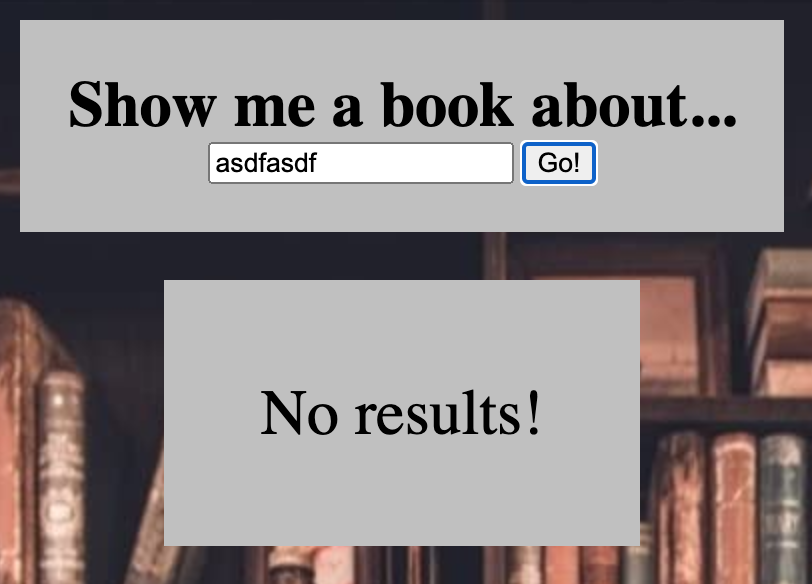

# Let's go to the library!
Your challenge is to build a site with the following user stories:

1. When I open the page, I see a simple form that consists of a text input and a submit button:

1. When I enter a genre keyword and submit, I see the title, author, and cover of a random book from that genre:

1. If the genre keyword is invalid for any reason (note that this API cannot handle spaces in search terms), I see an error message:

